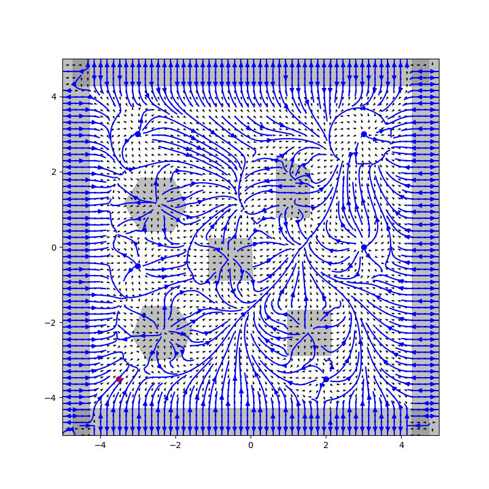
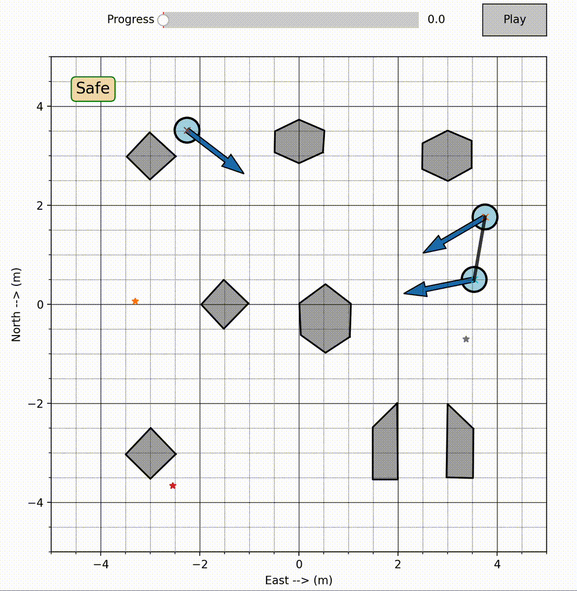

# PGFlow

Multi-agent plath planning algorithm with which agents can avoid other agents and obstacles. 

To run simple example, see `examples/` directory.

To run with more complex visualisers and with a pybullet drone simulator, see [FLightHouse](https://github.com/enac-drones/flighthouse).


<p align="center">
  
  
  
</p>


Cite this work as:

```
  @article{Bilgin2024,
    author    = {Z. Bilgin and I. Yavrucuk and M. Bronz},
    title     = {Urban air mobility guidance with panel method: Experimental evaluation under wind disturbances},
    journal   = {Journal of Guidance, Control, and Dynamics},
    volume    = {47},
    number    = {5},
    pages     = {1-17},
    year      = {2024},
    doi       = {10.2514/1.G007691}
  }
```

